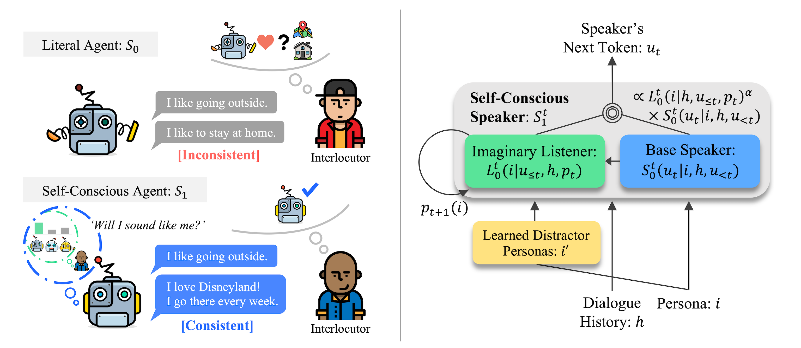

# Pragmatic Self-Consciousness<br>for Improving Persona Consistency in Dialogues



**Official PyTorch implementation of our EMNLP 2020 paper:**<br>
[Hyunwoo Kim](https://hyunw.kim), [Byeongchang Kim](https://bckim92.github.io), and [Gunhee Kim](https://vision.snu.ac.kr/gunhee). Will I Sound Like Me? Improving Persona Consistency in Dialogues through Pragmatic Self-Consciousness. _EMNLP_, 2020 [[Paper]](https://arxiv.org/abs/2004.05816)

* **TL;DR**: Inspired by social cognition and pragmatics, we model _public self-consciousness_ in existing dialogue agents with an imaginary listener to improve persona consistency. Compared to previous works, our method does not require additional consistency-related labels or training.

This work was also accepted at ICLR 2020 [Bridging AI and Cognitive Science (BAICS) workshop](https://baicsworkshop.github.io/) as an oral presentation.


## Reference

If you use the materials in this repository as part of any published research, we ask you to cite the following [paper](https://arxiv.org/abs/2004.05816):

```bibtex
@inproceedings{Kim:2020:selfc,
  title={Will I Sound Like Me? Improving Persona Consistency in Dialogues through Pragmatic Self-Consciousness},
  author={Kim, Hyunwoo and Kim, Byeongchang and Kim, Gunhee},
  booktitle={EMNLP},
  year=2020
}
```

## Code (TBU)

Our code is built on the [ParlAI](https://parl.ai/) framework.<br>
The codes will be updated soon!

### Have any question?
Please contact [Hyunwoo Kim](https://hyunw.kim) at hyunw.kim@vl.snu.ac.kr.

## Acknowledgements

We would like to thank [Reuben Cohn-Gordon](https://reubencohngordon.com/), [Sean Welleck](https://cs.nyu.edu/~welleck/), [Junhyug Noh](https://junhyug.github.io/) and [Jiwan Chung](https://vl.snu.ac.kr/people/jiwanchung.html) for their valuable comments. We also thank the anonymous reviewers for their thoughtful suggestions on this work.

This research was supported by Brain Research Program by National Research Foundation of Korea (NRF) (2017M3C7A1047860), Institute of Information \& communications Technology Planning \& Evaluation (IITP) grant funded by the Korea government (MSIT) (No. 2017-0-01772, Video Turing Test, No. 2019-0-01082, SW StarLab), and Creative Pioneering Researchers Program through Seoul National University.


## License

This repository is MIT licensed. See the [LICENSE](https://github.com/skywalker023/pragmatic-consistency/blob/master/LICENSE) file for details.
